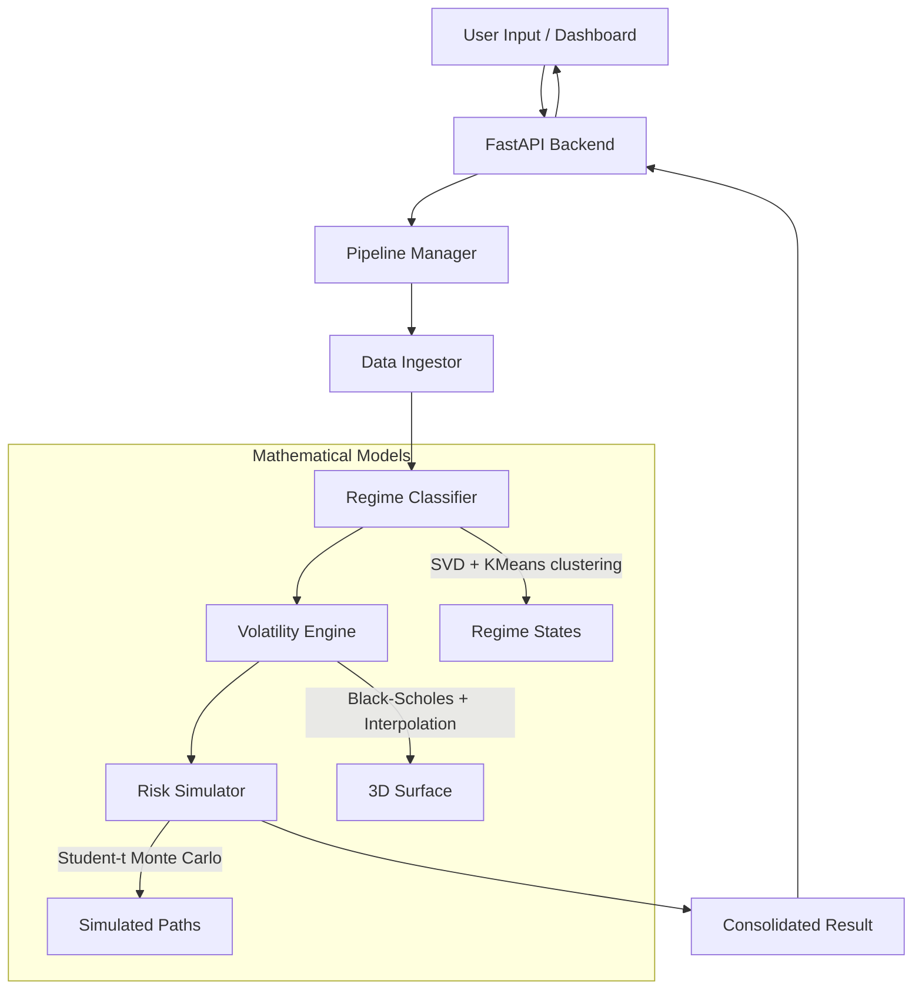

# 🛡️ Quant Research & Risk Engine

A production-grade, modular financial analytics system that integrates market data ingestion, volatility surface modeling, machine learning regime detection, and adaptive fat-tailed Monte Carlo risk simulation.

## 🏗️ Architecture



## 🚀 Quick Start

### 1. Install Dependencies
```bash
pip install -r requirements.txt
```

### 2. Start the Backend API
```powershell
# In PowerShell (Windows)
$env:PYTHONPATH="."
python -m backend.api.main
```
*The API will be available at http://localhost:8000*

### 3. Launch the Streamlit Dashboard
```bash
streamlit run frontend/streamlit_app.py
```
*The UI will open in your browser.*

## 🧠 Key Features

- **Context-Aware Pipeline**: The system detects the current market regime (High Vol, Low Vol, Trending) and automatically adjusts simulation parameters (degrees of freedom, volatility scaling) to reflect current risk levels.
- **Advanced Volatility Engine**: Models the volatility surface with both term structure (time-dependency) and equity skew (strike-dependency).
- **Fat-Tail Risk Modeling**: Uses Student-t distributions for Monte Carlo paths to capture "black swan" events better than standard Normal distributions.
- **Modular API Design**: Fully decoupled frontend and backend, allowing for easy integration into larger trading systems.

## 📊 Endpoints

- `POST /analyze`: Main analysis endpoint. Accepts JSON with `ticker`, `start_date`, and `end_date`.
- `POST /upload`: Upload a custom CSV for analysis.
- `GET /result/{id}`: Retrieve past analysis results.

## 🚀 User Interface

### Modern Dashboard (Next.js)
The primary interface is a high-performance, responsive Next.js 14 dashboard located in the `/web` directory.
- **Run Locally**:
  ```bash
  cd web
  npm install
  npm run dev
  ```
- **Features**: 3D interactive volatility surfaces, animated risk metrics, and glassmorphism UI.

### Legacy Dashboard (Streamlit)
The original Streamlit dashboard is available as a lightweight fallback in `/frontend`.
- **Run Locally**:
  ```bash
  streamlit run frontend/streamlit_app.py
  ```

## 🌐 Hosting & Deployment

### Backend (Vercel)
1.  **Preparation**: Ensure `vercel.json` and `api/index.py` are in the root.
2.  **Deploy**: Connect your repository to Vercel and set the environment variable `PYTHONPATH="."`.
3.  **URL**: Note your deployment URL (e.g., `https://your-app.vercel.app`).

### Frontend (Streamlit Cloud)
1.  **Deploy**: Connect your repository to [Streamlit Cloud](https://streamlit.io/cloud).
2.  **Secrets**: Open "Settings" -> "Secrets" and add your Vercel API URL:
    ```toml
    API_URL = "https://your-app.vercel.app"
    ```
3.  **Requirements**: Streamlit will automatically install dependencies from `requirements.txt`.

## ⚙️ Requirements
- Python 3.8+
- CPU-friendly (No GPU required for ML components)
