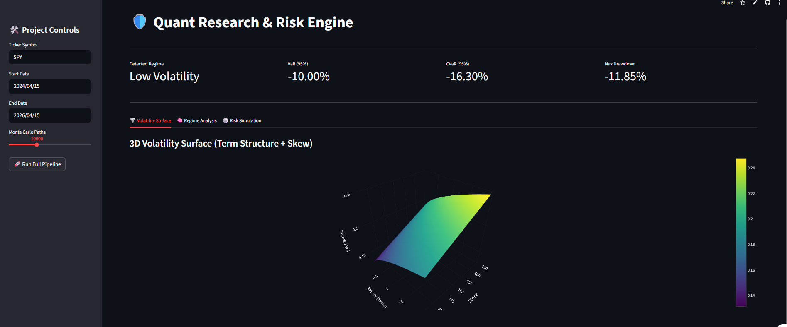
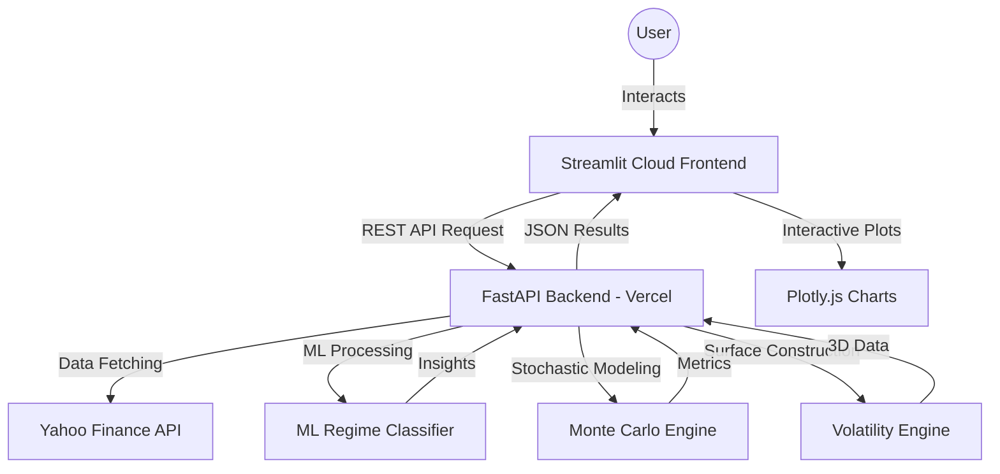

# 🛡️ Quantum Research & Risk Engine

[](https://quant-research-engine.streamlit.app/)
[](https://quant-research-risk-engine-web-appl-gules.vercel.app/)
[](https://www.python.org/)
[](https://opensource.org/licenses/MIT)

A high-performance, modular platform for **Regime-Aware Volatility Modeling** and **Monte Carlo Risk Simulations**. This engine combines machine learning for market state detection with advanced stochastic modeling to provide institutional-grade risk metrics.

---

## 🚀 Live Demo
**👉 [Launch the Quantum Risk Dashboard](https://quant-research-engine.streamlit.app/)**

---

## 📸 Dashboard Preview


---

## 🧠 Key Features

- **ML-Powered Regime Detection**: Uses Singular Value Decomposition (SVD) for dimensionality reduction and KMeans clustering to identify hidden market states (Low Vol, Trending, High Vol).
- **Adaptive Risk Simulations**: Executes 10,000+ path Monte Carlo simulations using Student-t distributions that automatically adjust degrees of freedom ($\nu$) based on the detected market regime.
- **3D Interactive Volatility Surfaces**: Visualizes the Implied Volatility Surface, modeling both the **Term Structure** (time to expiry) and the **Equity Skew** (strike price).
- **Serverless Hybrid Architecture**: High-speed FastAPI backend deployed on Vercel linked to a responsive Streamlit Cloud frontend.
- **Institutional Metrics**: Real-time calculation of Value at Risk (VaR 95%), Conditional VaR (CVaR), Sharpe Ratio, and Maximum Drawdown.

---

## 🏗️ System Architecture



---

## 📂 Repository Structure

```text
├── api/                # Vercel Serverless Function entry point
├── backend/            # Core Quant Engineering logic
│   ├── data/           # Data ingestion & cleaning
│   ├── regime/         # ML State Detection (SVD + KMeans)
│   ├── risk/           # Monte Carlo & VaR Engine
│   └── volatility/     # IV Surface modeling
├── frontend/           # Streamlit UI implementation
├── assets/             # Documentation visuals & screenshots
├── requirements.txt    # Unified dependency list
└── vercel.json         # Vercel deployment configuration
```

---

## 🚀 Getting Started

### Local Development

1. **Clone the repository**:
   ```bash
   git clone https://github.com/VedantJadhav701/Quant-Research-Risk-Engine-Web-Application.git
   cd Quant-Research-Risk-Engine-Web-Application
   ```

2. **Install dependencies**:
   ```bash
   pip install -r requirements.txt
   ```

3. **Run the Backend (Local)**:
   ```bash
   uvicorn api.index:app --reload
   ```

4. **Run the Frontend (Local)**:
   ```bash
   streamlit run frontend/streamlit_app.py
   ```

### Production Deployment
- **Backend**: Auto-deployed to Vercel on push.
- **Frontend**: Connect your GitHub repo to Streamlit Cloud and point the main file to `frontend/streamlit_app.py`.

---

## ⚠️ Disclaimer
**This project is for educational and research purposes only.** It does not constitute financial advice. Trading involves substantial risk of loss. The authors are not responsible for any financial losses incurred from the use of this code.

---

## 👨‍💻 Author
**Vedant Jadhav** - *Financial Engineer & AI Researcher*
